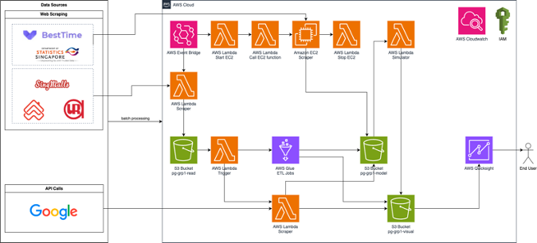
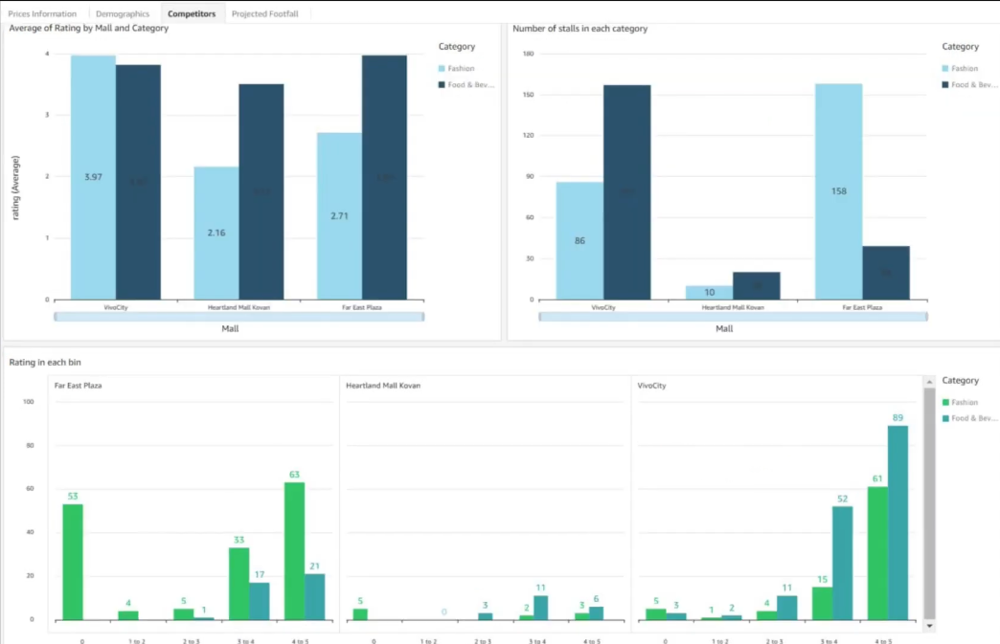
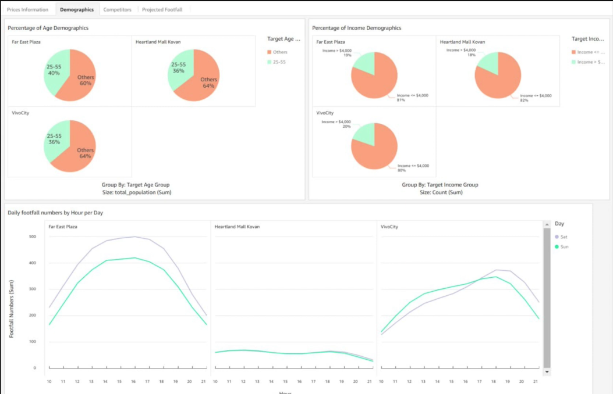
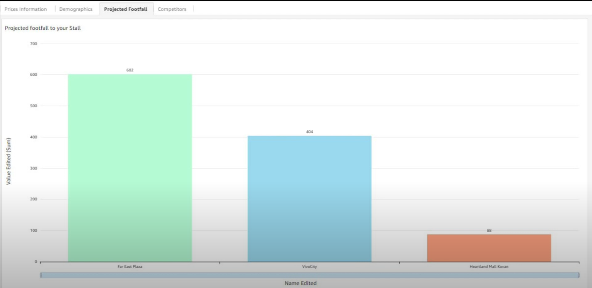

# Big Data Architecture with PropertyGuru

## Problem Statement
Prospective shop owners in malls often face challenges in selecting the most suitable mall for their stores due to limited visibility into the competitive landscape, complex decision-making processes, and the lack of accessible data and insights.

## Solution
Implement a data-driven tenant-matching platform to optimise store placement with data-driven insights for prospective shop owners in malls.

## Data Sources
* BestTime
* Statistics Singapore
* SingMalls
* PropertyGuru Data
* Urban Redevelopment Authority (URA)

## Tech Stack
* Puppeteer
* BeautifulSoup
* Pandas
* PySpark
* AWS

## Big Data Pipeline Architecture
Detailed explanation on the pipeline architecture: [Video](https://www.youtube.com/watch?v=MjCRU8VyMDQ)
  

## Analytics
Delving down on Far East Plaza, VivoCity and Heartland Mall. Feel free to click here and access the full presentation : 
[Final Presentation](https://docs.google.com/presentation/d/1AuYLCCPpob2rtDGITdEVSbp5hWXVzKmEkXFX4tnxQ2M/edit?usp=sharing)

### 1. Competitors
With an outstanding average rating of 5.57 for its booths, Far East Plaza stands out among the three malls. In contrast, VivoCity faces a challenge with an average rating struggling to surpass 2.71, suggesting a less consistent quality across its stalls. Heartland Mall falls in between, presenting a respectable average rating of 2.16. Delving into the specifics, it becomes evident that food establishments dominate the scene in each mall, with a mix of beverages and retail adding diversity. For those seeking top-notch stalls, Far East Plaza emerges as the preferred destination, while navigating VivoCity might require a more discerning search for quality options.

### 2. Demographics
In the landscape of three malls, Far East Plaza attracts a vibrant and affluent crowd, having the highest footfall. Following closely is VivoCity, aligning with a similar demographic appeal. In contrast, Heartland Mall Kovan caters to a distinct demographic, experiencing lower foot traffic. The visual representation of these trends through graphs provides a clear and dynamic illustration of shopper preferences, offering valuable guidance for aligning a business with its target audience. Whether the goal is to capture the enthusiasm of young spenders or engage with a diverse mix, the choice of the mall becomes a strategic decision in reaching the desired customer base.

### 3. Projected Footfall
Monte Carlo simulation can be employed to estimate footfall in a specific mall by considering various uncertain factors. The method involves assigning probability distributions to key variables such as footfall, income of the area, age demographics, shop types, probability of movement, and probability of purchase. By generating thousands of random samples from these distributions and applying them to the footfall estimation formula, a distribution of estimated footfall values is obtained. This approach captures the inherent variability and uncertainty in the input parameters, providing a probabilistic view of the footfall expectations. The results of Monte Carlo simulations offer valuable insights into the range of possible outcomes, aiding decision-makers in understanding the potential variability associated with footfall estimates for a potential shop in the specific mall.

## Poster
